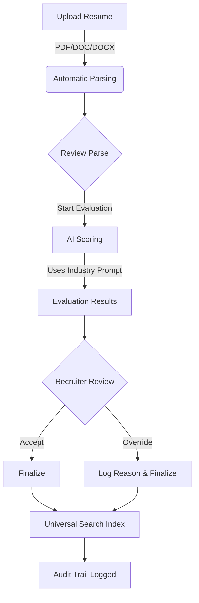

# AI-Driven Holistic Resume Evaluation Platform

A comprehensive, full-stack AI hiring platform that evaluates candidates holistically rather than relying on rigid keyword matching. This platform combines intelligent resume parsing, AI-powered evaluation, and human oversight to revolutionize the recruitment process.

## 🏗️ Project Overview

This is a monorepo containing both frontend and backend applications:

- **Frontend**: Modern React application with Vite, Tailwind CSS, and Radix UI
- **Backend**: Node.js/Express API with MongoDB, Redis, and AI integration
- **AI Integration**: Holistic evaluation using advanced language models
- **File Processing**: Intelligent parsing of PDF/DOC files with context preservation

## � Recent Bug Fixes & Updates

### ✅ Critical Bug Fixes & Updates (Latest)
- **Universal Search**: Implemented a global keyword search across the application for files, folders, and candidates.
- **Responsive Design**: Complete UI overhaul ensuring seamless experience across mobile, tablet, and desktop devices.
- **Navigation Issues**: Fixed improper `window.location.href` usage in Alerts component - replaced with React Router's `navigate()` hook.
- **React Hooks Violations**: Resolved synchronous `setState` calls within `useEffect` hooks.
- **Backend Routing**: Fixed critical crash in `auth` routes caused by incorrect middleware import.

### 🚀 Current Status
- **Mobile-Ready**: Fully responsive interface with adaptive layouts.
- **Runtime Errors**: All critical runtime errors resolved.
- **Build Status**: Frontend and backend build successfully without errors.
- **Code Quality**: ESLint configuration active with most critical issues resolved.

### 🛠️ Technical Improvements
- **Universal Search**: Unified search architecture connecting frontend to backend file services.
- **Performance**: Eliminated cascading renders from improper state updates.
- **User Experience**: Fixed navigation and component loading issues.

## �🚀 Key Features

### 🎯 Holistic Evaluation System
- **Multi-Industry Support**: Configurable evaluation prompts for IT, Healthcare, Finance, Manufacturing, and more
- **Context-Aware Analysis**: AI assesses experience context, project ownership, and domain relevance
- **Explainable AI**: Every score comes with detailed reasoning and evidence highlighting
- **Human-in-the-Loop**: Recruiters can override AI decisions with complete audit trail logging

### � Authentication & Security
- **Secure Login System**: Password-based authentication (Simplified for development: accepts any credentials)
- **Protected Account Creation**: Administrator password-controlled user registration
- **Instant Access Control**: Wrong passwords result in immediate redirect to login
- **Role-Based Access**: Different permissions for HR professionals and administrators

### �📁 Intelligent Resume Processing
- **Multi-Format Support**: PDF, DOC, and DOCX file parsing
- **Context Preservation**: Maintains semantic meaning during parsing
- **Skill Extraction**: Automatic identification and categorization of technical and soft skills
- **Experience Analysis**: Deep understanding of role progression and project complexity

### 🔍 Universal Search
- **Global File Search**: Instantly find resumes, documents, and folders.
- **Smart Filtering**: Filter results by type (PDF, DOCX, Folder).
- **Quick Navigation**: Jump directly to search results with a single click.

### 🎛️ Comprehensive Management
- **Hiring Forms**: Define role requirements, cut-offs, and evaluation weights
- **Prompt Management**: Configure industry-specific evaluation prompts with version control
- **Audit Trail**: Complete logging system for compliance and accountability
- **Analytics Dashboard**: Real-time insights into evaluation patterns and success metrics

## 🛠️ Technology Stack

### Frontend (my-app/)
- **Framework**: React 19.2.0 with Vite (rolldown-vite)
- **Styling**: Tailwind CSS 4.1.18
- **Routing**: React Router DOM
- **UI Components**: Radix UI primitives & ShadCN UI
- **Icons**: Heroicons React & Lucide React
- **File Upload**: react-dropzone
- **HTTP Client**: Axios
- **State Management**: React hooks and context
- **Animations**: tw-animate-css

### Backend (backend/)
- **Runtime**: Node.js 16+ with Express.js 4.18.2
- **Database**: MongoDB with Mongoose ODM
- **Caching**: Redis for session management and performance
- **Authentication**: JWT with refresh tokens
- **File Processing**: Multer, pdf-parse, mammoth (for DOCX)
- **Queue System**: Bull for background job processing
- **AI Integration**: OpenAI/Anthropic APIs
- **File Storage**: AWS S3 integration
- **Security**: Helmet, CORS, rate limiting, input validation

## 📦 Installation & Setup

### Prerequisites
- Node.js 18.0.0 or higher
- npm 8.0.0 or higher
- MongoDB 5.0 or higher
- Redis 6.0 or higher
- AWS account (for S3 file storage)

### 1. Clone the Repository
```bash
git clone <repository-url>
cd resume-project
```

### 2. Frontend Setup
```bash
cd my-app

# Install dependencies
npm install

# Copy environment template
cp .env.example .env

# Start development server
npm run dev

# Build for production
npm run build

# Preview production build
npm run preview
```

### 3. Backend Setup
```bash
cd backend

# Install dependencies
npm install

# Copy environment template
cp .env.example .env

# Configure environment variables (see .env.example section below)

# Start development server
npm run dev

# Start production server
npm start
```

### 4. Environment Configuration

#### Frontend (.env)
```env
VITE_API_BASE_URL=http://localhost:3000/api
VITE_APP_NAME=AI Resume Evaluation Platform
VITE_APP_VERSION=1.0.0
```

#### Backend (.env)
```env
# Server Configuration
NODE_ENV=development
PORT=3000
FRONTEND_URL=http://localhost:5173

# Database Configuration
DATABASE_URL=mongodb://localhost:27017/resume-evaluation
REDIS_URL=redis://localhost:6379

# JWT Configuration
JWT_SECRET=your-super-secret-jwt-key-here
JWT_REFRESH_SECRET=your-super-secret-refresh-key-here

# AWS Configuration
AWS_ACCESS_KEY_ID=your-aws-access-key
AWS_SECRET_ACCESS_KEY=your-aws-secret-key
AWS_REGION=us-east-1
AWS_S3_BUCKET=your-s3-bucket-name

# AI Service Configuration
OPENAI_API_KEY=your-openai-api-key
ANTHROPIC_API_KEY=your-anthropic-api-key

# Email Configuration (optional)
SMTP_HOST=smtp.gmail.com
SMTP_PORT=587
SMTP_USER=your-email@gmail.com
SMTP_PASS=your-app-password

# File Upload Configuration
MAX_FILE_SIZE=10485760
ALLOWED_FILE_TYPES=pdf,doc,docx

# Rate Limiting
RATE_LIMIT_WINDOW_MS=900000
RATE_LIMIT_MAX_REQUESTS=100
```

## 🏗️ Project Structure

```
resume-project/
├── README.md                    # This file
├── API_DOCUMENTATION.md         # Comprehensive API documentation
├── my-app/                      # Frontend React application
│   ├── public/                  # Static assets
│   ├── src/
│   │   ├── components/          # Reusable React components
│   │   │   ├── Layout.jsx       # Main application layout
│   │   │   └── ui/              # UI component library
│   │   ├── pages/               # Page components
│   │   ├── hooks/               # Custom React hooks
│   │   ├── lib/                 # Utility functions
│   │   ├── services/            # API service layer
│   │   └── styles/              # Global styles
│   ├── package.json
│   └── README.md                # Frontend-specific README
└── backend/                     # Backend Node.js application
    ├── src/
    │   ├── controllers/         # Route controllers
    │   ├── middleware/          # Express middleware
    │   ├── models/              # MongoDB models
    │   ├── routes/              # API routes
    │   ├── services/            # Business logic services
    │   ├── utils/               # Utility functions
    │   └── workers/             # Background job workers
    ├── package.json
    ├── README.md                # Backend-specific documentation
    └── server.js                # Application entry point
```

## 🎯 Core Functionality

### 1. Dashboard & Analytics
- Real-time evaluation statistics
- Industry distribution insights
- Recent activity tracking
- Performance metrics and KPIs

### 2. Resume Upload & Processing
- Drag-and-drop file upload interface
- Real-time parsing preview
- Multi-format support (PDF, DOC, DOCX)
- Intelligent content extraction

### 3. AI-Powered Evaluation
- Holistic candidate assessment
- Industry-specific evaluation criteria
- Evidence-based scoring
- Explainable AI recommendations

### 4. Hiring Form Management
- Customizable role definitions
- Evaluation weight configuration
- Cut-off threshold settings
- Industry-specific templates

### 5. Prompt Engineering
- Industry-specific evaluation prompts
- Version control and rollback
- A/B testing capabilities
- Performance analytics

### 6. Human Oversight
- AI recommendation override
- Detailed audit trail
- Collaborative decision making
- Compliance reporting

## 🔄 Post-Upload Workflow

Here is exactly what happens after a resume is uploaded:




### 1️⃣ Resume is parsed automatically
* PDF / DOC / DOCX is read by the backend
* Text, skills, experience, projects are extracted
* Resume is saved in the database
* Parsing preview is shown in UI

👉 **User action**: Review the parsed content

### 2️⃣ Start AI evaluation
* Select or create a **Hiring Form** (role, industry, cut-offs)
* Click **“Start Evaluation”**
* Resume is sent to AI with industry-specific prompt

👉 **User action**: Choose role + start evaluation

### 3️⃣ View evaluation results
You get:
* Overall score (0–100)
* Category-wise breakdown (skills, experience, projects)
* Strengths and gaps
* Evidence highlighted from resume
* AI reasoning (why this score)

👉 **User action**: Review AI decision

### 4️⃣ Human override (optional)
* Recruiter can **accept / reject / override** AI result
* Add a reason (mandatory)
* Override is logged in audit trail

👉 **User action**: Make final decision

### 5️⃣ Search & manage resumes
* Resume becomes searchable via **Universal Search**
* Can filter by name, skill, file type
* Open resume or evaluation directly

👉 **User action**: Find resumes instantly later

### 6️⃣ Audit trail is updated
Every action is logged:
* Upload
* Evaluation
* Override
* User action
* Timestamp

👉 **User action**: View audit logs if needed

### 🧠 One-line flow (interview friendly)
> "After upload, the resume is parsed, evaluated by AI using role-specific criteria, reviewed by a recruiter, optionally overridden, and fully logged for compliance."

### ❌ What does NOT happen automatically yet
* No interview scheduling
* No candidate email
* No ATS push
* No video analysis

## �🔧 API Documentation

Comprehensive API documentation is available in [API_DOCUMENTATION.md](./API_DOCUMENTATION.md), including:

- Authentication & authorization
- Resume processing endpoints
- Evaluation management
- Hiring form CRUD operations
- Prompt management
- Audit trail access
- Background job monitoring

## 🗄️ Database Schema

### Core Collections

#### Users
- Authentication and authorization
- Profile management
- Performance tracking
- Role-based access control

#### Resumes
- File metadata and storage
- Parsed content structure
- Processing status tracking
- Skill extraction results

#### Evaluations
- AI evaluation results
- Scoring breakdown
- Evidence highlighting
- Human override history

#### Hiring Forms
- Role definitions
- Evaluation criteria
- Industry configurations
- Cut-off thresholds

#### Prompts
- Industry-specific templates
- Version control
- Usage analytics
- Performance metrics

#### Audit Trail
- Complete action logging
- Compliance tracking
- Security monitoring
- Change history

## 🔒 Security Features

- **Authentication**: JWT-based authentication with refresh tokens
- **Authorization**: Role-based access control (Admin, HR Manager, Recruiter)
- **Input Validation**: Comprehensive validation using Joi and express-validator
- **File Security**: Malware scanning and type validation
- **Rate Limiting**: Configurable rate limits per endpoint
- **Data Encryption**: Sensitive data encryption at rest
- **Audit Logging**: Complete traceability for compliance
- **CORS Protection**: Cross-origin request security
- **Helmet Integration**: Security headers configuration

## 🚀 Deployment

### Frontend Deployment
The frontend is a static application that can be deployed to any hosting service:

```bash
# Build the application
cd my-app
npm run build

# Deploy the dist/ folder to your hosting service
```

**Compatible with:**
- Vercel (recommended)
- Netlify
- AWS S3 + CloudFront
- GitHub Pages
- Any static hosting service

### Backend Deployment
The backend requires a Node.js runtime and can be deployed to:

- AWS EC2 or Elastic Beanstalk
- Google Cloud Platform
- DigitalOcean
- Heroku
- Any VPS with Node.js support

### Docker Deployment
```dockerfile
# Backend Dockerfile example
FROM node:18-alpine
WORKDIR /app
COPY package*.json ./
RUN npm ci --only=production
COPY . .
EXPOSE 3000
CMD ["npm", "start"]
```

### Environment-Specific Configurations
- **Development**: Local MongoDB/Redis, detailed logging
- **Staging**: Cloud databases, reduced logging
- **Production**: Managed services, optimized performance

## 📊 Performance & Monitoring

### Caching Strategy
- **Redis**: Session management, API response caching
- **Application-level**: Frequently accessed data caching
- **CDN**: Static asset delivery

### Background Processing
- **Bull Queue**: Asynchronous job processing
- **AI Evaluations**: Non-blocking evaluation processing
- **Email Notifications**: Background email sending
- **Report Generation**: Async report creation

### Monitoring & Logging
- **Winston**: Structured logging
- **Morgan**: HTTP request logging
- **Performance Metrics**: Response time tracking
- **Error Tracking**: Comprehensive error logging

## 🧪 Testing

### Frontend Testing
```bash
cd my-app
npm test                    # Run tests
npm run test:watch         # Watch mode
npm run test:coverage      # Coverage report
```

### Backend Testing
```bash
cd backend
npm test                    # Run tests
npm run test:watch         # Watch mode
npm run test:coverage      # Coverage report
```

### Test Coverage Areas
- **Unit Tests**: Component and function testing
- **Integration Tests**: API endpoint testing
- **E2E Tests**: Complete user workflows
- **Performance Tests**: Load and stress testing

## 🤝 Contributing

We welcome contributions! Please follow these guidelines:

1. **Fork** the repository
2. **Create** a feature branch (`git checkout -b feature/amazing-feature`)
3. **Commit** your changes (`git commit -m 'Add amazing feature'`)
4. **Push** to the branch (`git push origin feature/amazing-feature`)
5. **Open** a Pull Request

### Development Guidelines
- Follow ESLint and Prettier configurations
- Write comprehensive tests for new features
- Update documentation for API changes
- Ensure all tests pass before submitting

## 📝 License

This project is licensed under the MIT License - see the [LICENSE](LICENSE) file for details.

## 🎯 Success Metrics

The platform aims to achieve:
- **40% reduction** in false rejections
- **35% improvement** in shortlist quality
- **60% decrease** in recruiter screening time
- **90% recruiter trust** in AI decisions
- **50% faster** time-to-hire for qualified candidates

## 🔄 Future Enhancements

### Phase 2 Features
- **Interview Scheduling**: Automated calendar integration
- **Video Resume Analysis**: Multimedia content evaluation
- **Advanced Analytics**: Predictive hiring analytics
- **Multi-language Support**: Global deployment capabilities
- **ATS Integrations**: Seamless integration with existing systems
- **ML Model Improvements**: Continuous learning and optimization

### Technical Roadmap
- **Microservices Architecture**: Scalable service decomposition
- **GraphQL API**: More efficient data fetching
- **Real-time Collaboration**: Multi-user evaluation features
- **Mobile Applications**: Native iOS/Android apps
- **Advanced AI**: Custom model training and fine-tuning

## 📞 Support & Documentation

### Getting Help
- **Issues**: Create an issue in the repository
- **Documentation**: Check [API_DOCUMENTATION.md](./API_DOCUMENTATION.md)
- **Wiki**: Detailed guides and tutorials
- **Community**: Join our Discord/Slack community

### Troubleshooting
- **Audit Trail**: Review system logs for issues
- **Health Checks**: Monitor service status
- **Performance**: Check system metrics
- **Common Issues**: FAQ in documentation

## 🏆 Acknowledgments

- **OpenAI**: For advanced language model capabilities
- **MongoDB**: For robust database solutions
- **React Community**: For excellent UI frameworks
- **Tailwind CSS**: For utility-first styling
- **Contributors**: Thank you to all who contribute to this project

---

**Built with ❤️ for fairer, more effective hiring processes**

*Transforming recruitment through AI-powered holistic evaluation*
# Resume-Project
